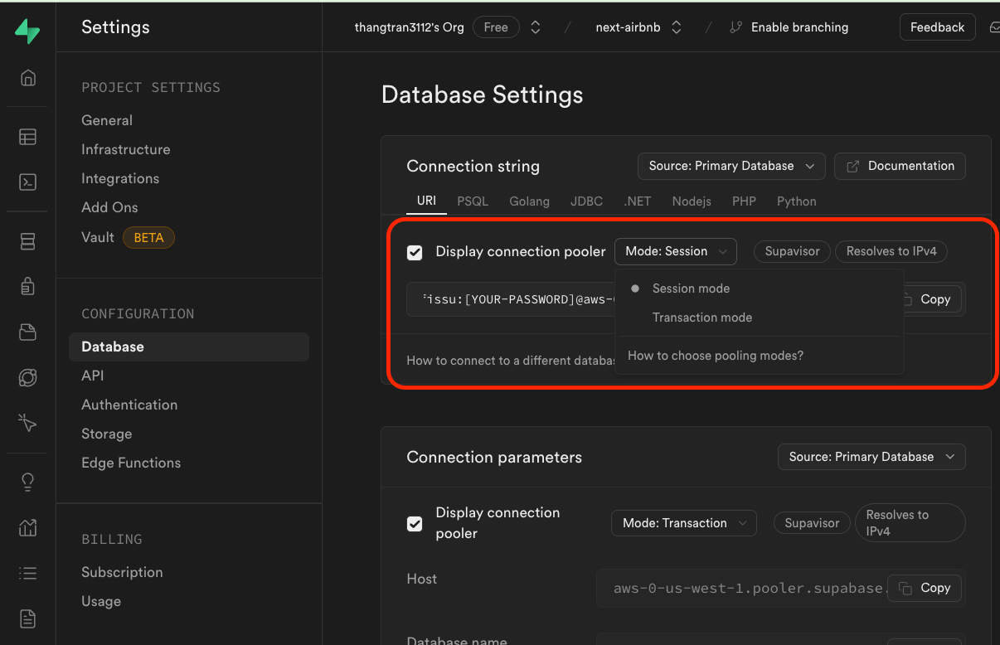
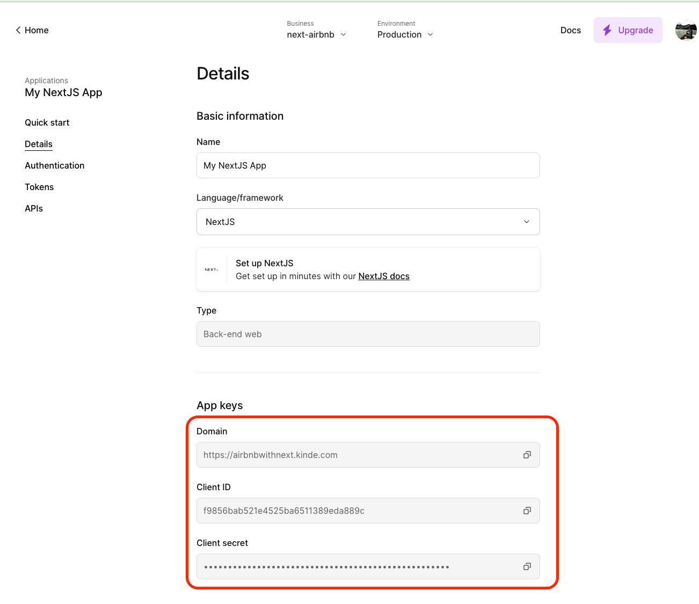
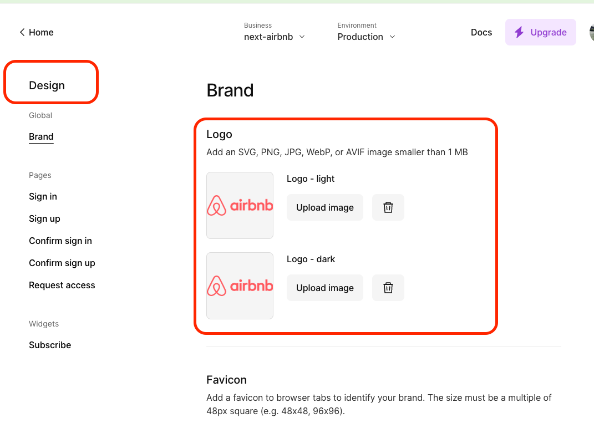

# NextJS app with Shadcn UI

## Installations

- [Installation of Shadcn UI](https://ui.shadcn.com/docs/installation/next)

```bash
npx create-next-app@latest
npx shadcn-ui@latest init
npx shadcn-ui@latest add button
```

## Prisma and Supabase Installation

```bash
npm i -D prisma
npm i --save @prisma/client
npx prisma init
```

- Testing pushing Prisma schema to Supabase, after setting up `DATABASE_URL` and `DIRECT_URL`:

```bash
npx prisma db push
npx prisma studio
npx prisma generate
```

- We should only provide a Singleton prisma client in development local server, as Hot Reload would create new clients for every code changes. See [Primsa NextJS best practices](https://www.prisma.io/docs/orm/more/help-and-troubleshooting/help-articles/nextjs-prisma-client-dev-practices)
- Read [Prisma Supabase Integration](https://supabase.com/partners/integrations/prisma)
- We must use `DATABASE_URL` in `Transaction Mode`, while `DIRECT_URL` is in `Session Mode`. For `DATABASE_URL` connection string, we need to attach `?pgbouncer=true&connection_limit=1` to it, as we will use serverless hosting.
- See the picture below on how to find Supabase connection strings for `DATABASE_URL` and `DIRECT_URL`:
  

## Kinde installations

- [Installation of kinde-auth sdk](https://docs.kinde.com/developer-tools/sdks/backend/nextjs-sdk/)

```env
KINDE_CLIENT_ID=<your_kinde_client_id>
KINDE_CLIENT_SECRET=<your_kinde_client_secret>
KINDE_ISSUER_URL=https://<your_kinde_subdomain>.kinde.com
KINDE_SITE_URL=http://localhost:3000
KINDE_POST_LOGOUT_REDIRECT_URL=http://localhost:3000
KINDE_POST_LOGIN_REDIRECT_URL=http://localhost:3000/dashboard
```

- Create auth route at `app/api/auth/[kindeAuth]/route.ts` with:

```ts
import { handleAuth } from "@kinde-oss/kinde-auth-nextjs/server";
export const GET = handleAuth();
```

- See example of how to handle auth with Kinde at [Kinde NextJS SDK Authentication](https://docs.kinde.com/developer-tools/sdks/backend/nextjs-sdk/#authentication)

- Create `.env` file and fill in domain, clintId and clientSecret. See picture below:
  

- Customize Register and Login with our own logo, button and link colors at Kinde `Design` tab. See picture below:


